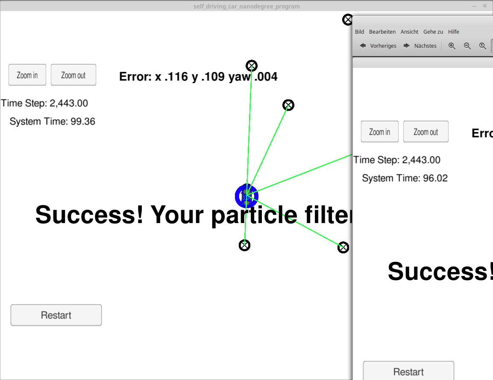
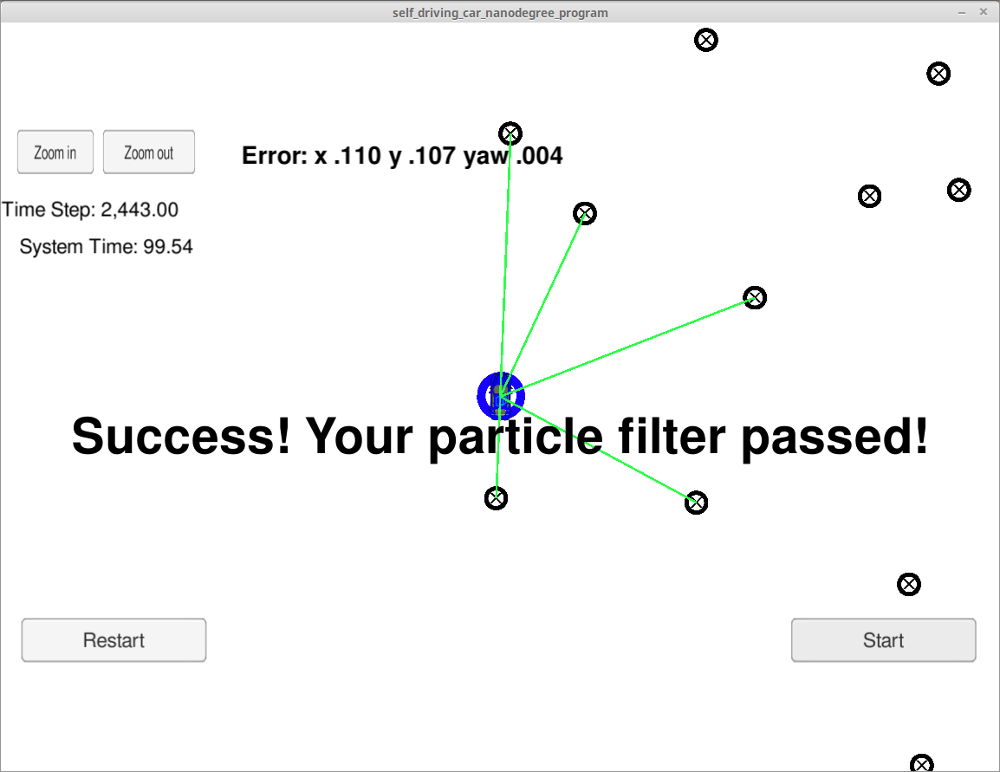
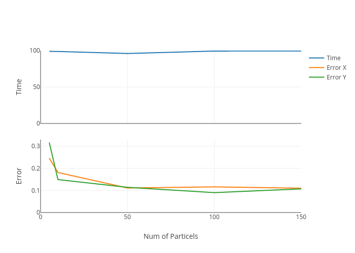

## Project Introduction
Your robot has been kidnapped and transported to a new location! Luckily it has a map of this location, a (noisy) GPS estimate of its initial location, and lots of (noisy) sensor and control data.

In this project you will implement a 2 dimensional particle filter in C++. Your particle filter will be given a map and some initial localization information (analogous to what a GPS would provide). At each time step your filter will also get observation and control data. 

## Running the Code
This project involves the Term 2 Simulator which can be downloaded [here](https://github.com/udacity/self-driving-car-sim/releases)

This repository includes two files that can be used to set up and intall uWebSocketIO for either Linux or Mac systems. For windows you can use either Docker, VMware, or even Windows 10 Bash on Ubuntu to install uWebSocketIO.

Once the install for uWebSocketIO is complete, the main program can be built and ran by doing the following from the project top directory.

1. mkdir build
2. cd build
3. cmake ..
4. make
5. ./particle_filter

## Inputs to the Particle Filter
You can find the inputs to the particle filter in the `data` directory. 

#### The Map*
`map_data.txt` includes the position of landmarks (in meters) on an arbitrary Cartesian coordinate system. Each row has three columns
1. x position
2. y position
3. landmark id

## Success Criteria
If your particle filter passes the current grading code in the simulator (you can make sure you have the current version at any time by doing a `git pull`), then you should pass! 

The things the grading code is looking for are:

1. **Accuracy**: your particle filter should localize vehicle position and yaw to within the values specified in the parameters `max_translation_error` and `max_yaw_error` in `src/main.cpp`.

2. **Performance**: your particle filter should complete execution within the time of 100 seconds.

## Results
The main goals of this project is to develop a c++ Particle filter that successfully estimates the position of the car from the Udacity Simulator. Figure 1 depicts an example of the filter estimating (blue circle) the object position. The RMSE (Root Mean Square Error) values estimates the accuracy of the Particle Filter Estimation.

I experimented with the number of particels. So I made a try with 10, 50, 100 and 150 particels:

| Particels | 5| 10  | 50  | 100 | 150 |
|-----|---------------------------|---------------------------|---------------------------|---------------------------|---------------------------|
| Time | 98.94 | 98.8 | 96.02 | 99.36 | 99.54|
| Error X |0.246 | 0.181 | 0.111 | 0.116 | 0.110 |
| Error Y | 0.317 | 0.149 | 0.114 | 0.09 |0.107
| Images |  |   |   |   |  

## Analysis
Lookin at the amound of time the values are in a prity smal range. To drop the prosessing time significantly it would be better to reduce the number of used landmarks.

The error drops significantly until 50 Particels. This seams to be the optimum in this setting.

Klick to play around:
